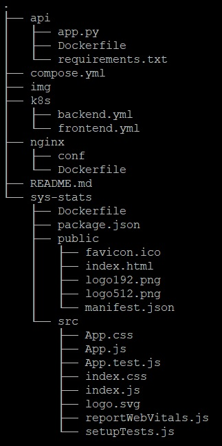

# DevOps-Assignment

## Folder Structure

## Task 1 - Dockerize the Application

Ask was to create seperate containers for each app and bring them up with single command `docker-compose up --build`

1. Add Dockerfile under each app i.e under `api` (backend) 
2. Add Dockerfile `sys-stats` ( frontend ) 
	* Add proxy entry in package.json - so that frontend app can call backend
	* Add .env with variable `DANGEROUSLY_DISABLE_HOST_CHECK=true` 
3. Make folder `nginx` ( proxy )
	* Add basic configuration file to proxy frontend
	* Add Dockerfile
4. create compose.yml under project root folder
	* Build context would be Dockerfile under respective app
	* Only publish port for proxy server ( compose will build a default network where containers can refer to each other with service name)
5. From project root folder run `docker-compose up --build`
 
## Task 2 - Deploy on Cloud

Ask is to deploy containerized apps to cloud

1. For simplicity, took an AWS EC2 instance, installed docker and hosted containers 
2. Added inbound rule security group to allow traffic on tcp port 80
3. can access the hosted docker container with Public Ipv4 DNS `ec2-35-175-196-13.compute-1.amazonaws.com`

> For Production, we can use any container service like ECS or EKS

### Task 3 - Get it to work with Kubernetes

Ask is to deploy apps to k8s and make it work

> Refer `k8s` folder for deployment\configuration yamls

